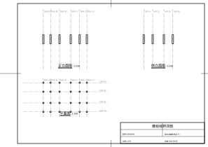
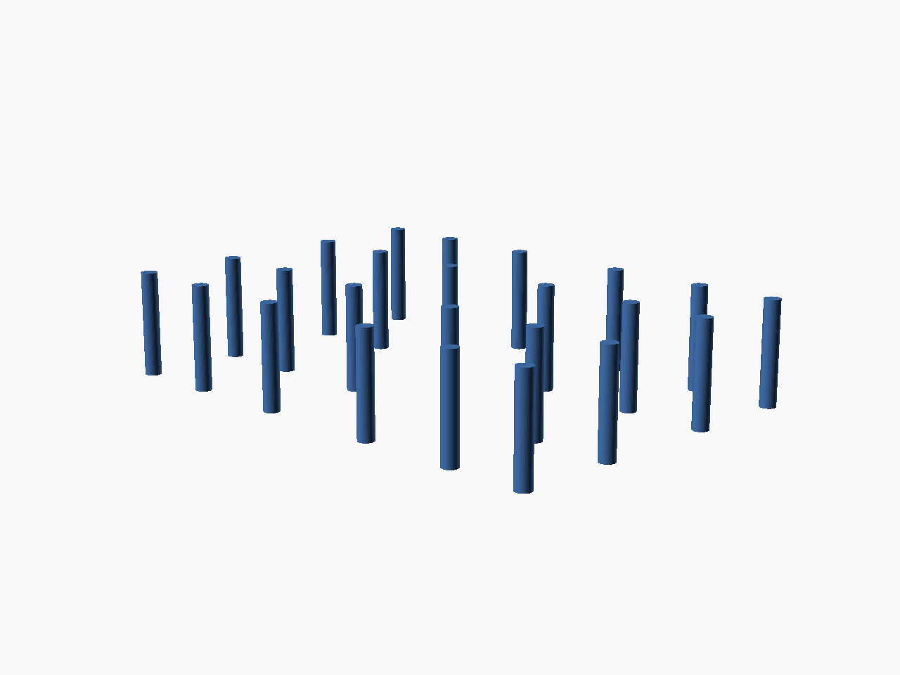

# CHBIM Prototype V1

[简体中文](README.md) | English

**A parametric modeling prototype for traditional Chinese timber-frame architecture, with OpenSCAD as the geometry core**

Chinese Historic Building Information Modeling — a BIM organization method based on traditional Chinese construction practice. Prototype V1 is an open-source feasibility study aimed at researchers: [OpenSCAD](https://openscad.org) serves as a scriptable, versionable, reproducible geometry core; axis lines (*seams*) and members are described as JSON data; a Python glue layer converts them into OpenSCAD instance code and automatically exports models and three-view drawings reusable in Blender / Adobe Illustrator / AutoCAD.

> **Current scope**: the *yanzhu* (eave column) only; the Web workbench supports
> real-time adjustment of the modular diameter D. See [PROGRESS.md](PROGRESS.md)
> and [docs/DECISIONS.md](docs/DECISIONS.md) for what V1 does and does not cover.

## Example Output (D=300, snapshot of v0.3.0 semantics)

<table>
  <tr>
    <td align="center">
      <br>
      <sub>Three-view drawing · <code>make build D=300</code> (A4, GB/T 50001-2017 frame &amp; title block)</sub>
    </td>
    <td align="center">
      <br>
      <sub>Off-screen render of the same model (STL)</sub>
    </td>
  </tr>
</table>

Snapshots are refreshed manually via `make snapshot`; `build/` itself is not committed.

---

## Why OpenSCAD

- **Purely functional geometry** — parametric, no GUI state; well suited to CI and version control
- **Full CLI support** — headless rendering/exports to stl / obj / svg / png
- **Free and open source** — lowers the barrier for reproducible research
- **Composable with Python** — OpenSCAD handles geometry, Python handles data and sheet layout (division of labor below)

## Repository Layout

```
core/    Build layer: pure .scad member library (OpenSCAD modeling core)
data/    Data layer: axis & member JSON
bridge/  Glue layer: seam codes → coordinates → .scad instance code
sheet/   Drawing pipeline: three views + title + scale + date
app/     Web workbench (stdlib HTTP, three.js preview)
tests/   Smoke tests
docs/    ADR / journal / coding system
```

## Quick Start

Requirements:

- OpenSCAD ≥ 2021.01 (development verified on 2026.06.12, macOS)
- Python 3.10+ with `reportlab` (`pip install reportlab`)

```bash
git clone <repo>
cd chbim-prototype
pip install reportlab
make build D=300    # generates stl/obj/svg/pdf/preview under build/
make serve          # Web workbench: http://127.0.0.1:8765
make test           # run smoke tests
```

## Coding System

V1 seam codes follow the "seam-based coding system" (details in
[docs/coding-system.md](docs/coding-system.md), Chinese only for now):

- Orientation: `F` front / `B` back / `L` left / `R` right
- Inner/outer: `i` inner / `o` outer
- Seam types: `CAO` (cao) / `JIAN` (jian bay) / `TUAN` (tuan purlin line) — others not yet supported in V1
- Member: `{type in lowercase pinyin}[{seam1}, {seam2}]`; position = intersection of its two seams

Example: `yanzhu[CAO_Fo, JIAN_L1]` = an eave column at the intersection of the front cao seam and the left-first jian seam.

## Documentation

- [PROGRESS.md](PROGRESS.md) — feature matrix & requirement pool
- [docs/users.md](docs/users.md) — user personas, workflows & pain points
- [docs/DECISIONS.md](docs/DECISIONS.md) — architecture decision index
- [docs/coding-system.md](docs/coding-system.md) — seam-based coding system (Chinese)
- [docs/adr/](docs/adr/) — architecture decision records (immutable)
- [docs/journal/](docs/journal/) — development journal (successes and failures)
- [CHANGELOG.md](CHANGELOG.md) — release changes

## Acknowledgments

This project is developed in a human–AI collaboration: the author is responsible
for the architecture, traditional construction terminology, and all academic
decisions of the coding system; [WorkBuddy](https://www.workbuddy.cn),
[Trae](https://www.trae.ai), and the GLM family of large models (GLM-5.3 and
GLM-5.3-Flash during development, as of 2026-09) assisted with code scaffolding,
documentation drafts, and engineering implementation.

- Scope of AI involvement: code implementation assistance, documentation drafting,
  test scaffolding; all architectural decisions and academic content (the seam
  coding system, etc.) were reviewed and are owned by the author.
- AI usage in the academic paper will be disclosed separately per the target
  journal's policy.

## License

- **Code**: MIT License — see [LICENSE](LICENSE).
- **Documentation & coding system**: all rights reserved for now (an academic
  paper is in preparation) — see [LICENSE-docs.md](LICENSE-docs.md); it will be
  relicensed under CC BY 4.0 once the paper is published.

> OpenSCAD is invoked as a subprocess only; the repository does not link any of
> its libraries and is therefore not affected by its GPL licensing. Researchers
> may cite, adapt, and redistribute the code without restrictions; for reuse of
> the coding system described in the docs, please contact the author first
> (academic citation and discussion are always welcome).
